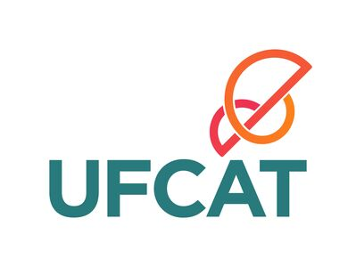

<h1>Seja bem vindo ao projeto PRPETEC</h1>

<table>
<tr>
<td style="width:70%;">
O projeto PRPE TEC é um projeto voltado a dinamizar seções públicas através do uso de tecnologia de recursos computacionais avançados. Este repositório público tem como objetivo central a apresentação dos resultados deste projeto executado na Pró-Reitoria de Políticas Estudantis (PRPE) da Universidade Federal de Catalão (UFCAT).
</td>
<td style="width:30%;"></td>  
</tr>
</table>  

<h1>Desenvolvimento</h1>
 
- [Prof. Wanderlei Malaquias Pereira Junior](http://lattes.cnpq.br/2268506213083114)     
- [Ma. Jordana Alves de Aguiar](http://lattes.cnpq.br/6397960074636015)       

<h1>Índice</h1>

<dl>
  <dt>POP's</dt>
  <dd><a href="https://ufcatprpe.github.io/PRPE/001-guia-ru.html" target="_blank">Guia processo de pagamento mensal do RU (PRPE0001.2023-1)</a></dd>
  <!--
  <dt>Common Library</dt>
  <dd><a href="https://wmpjrufg.github.io/META_TOOLBOX/CO.html" target="_blank">Common Library</a></dd>
  <dt>Algorithms</dt>
  <dd><a href="https://wmpjrufg.github.io/META_TOOLBOX/HC.html" target="_blank">Hill Climbing</a></dd>
  <dd><a href="https://wmpjrufg.github.io/META_TOOLBOX/SA.html" target="_blank">Simulated Annealing</a></dd>
  <dd><a href="https://wmpjrufg.github.io/META_TOOLBOX/FA.html" target="_blank">Firefly algorithm</a></dd>
  --> 
</dl>

